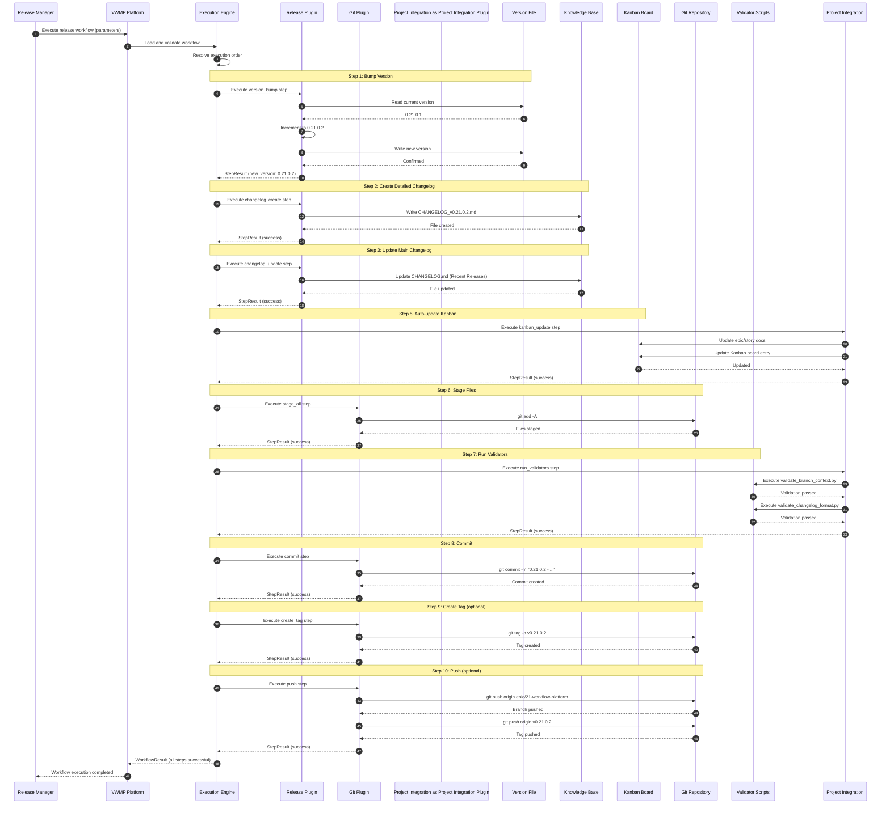

# Epic 01: VWMP Integration Architecture

**Status:** Draft
**Epic:** Epic 01 - Visual Workflow Management Platform (VWMP)
**Last Updated:** 2025-11-20
**Related Artifacts:**
- `KB/Architecture/container/overview/epic01-vwmp-container.md`
- `KB/Architecture/component/overview/epic01-vwmp-components.md`
- `KB/Architecture/Standards_and_ADRs/E01-vwmp-platform-architecture.md`
- `KB/Architecture/Integration_Architecture/vwmp/VWMP-Architecture-Gap-Analysis.md`

---

## System Architecture Overview

```mermaid
graph TB
    subgraph "VWMP Platform"
        UI[Visual Workflow Designer]
        API[Workflow Management API]
        Engine[Workflow Execution Engine]
        Registry[Plugin Registry]
    end

    subgraph "Workflow Plugins"
        Release[Release Workflow Plugin]
        Git[Git Integration Plugin]
        Project Integration[Project Integration Integration Plugin]
        Future[Future Workflow Types]
    end

    subgraph "External Systems"
        GitRepo[Git Repository]
        KB[Knowledge Base KB/]
        Kanban[Kanban Board Trello/MCP]
        Validators[Validator Scripts]
        VersionFile[Version File VERSION]
        README[README.md]
        Changelog[CHANGELOG.md]
        FS[File System]
    end

    subgraph "Storage"
        WorkflowStorage[Workflow Definitions YAML/JSON]
        ExecHistory[Execution History DB/File]
    end

    %% User interactions
    UI -->|REST API / WebSocket| API
    API -->|Execute workflows| Engine
    Engine -->|Load plugins| Registry
    Registry -->|Provide handlers| Release
    Registry -->|Provide handlers| Git
    Registry -->|Provide handlers| Project Integration
    Registry -->|Provide handlers| Future

    %% Release workflow integrations
    Release -->|Read/Write| VersionFile
    Release -->|Write| Changelog
    Release -->|Read/Write| README
    Release -->|Write| KB
    Release -->|Update| Kanban
    Release -->|Execute| Validators

    %% Git plugin integrations
    Git -->|git commands| GitRepo
    Git -->|Stage files| FS
    Git -->|Commit/Tag/Push| GitRepo

    %% Project Integration plugin integrations
    Project Integration -->|Execute scripts| Validators
    Project Integration -->|Update docs| KB
    Project Integration -->|Update board| Kanban

    %% Storage
    API -->|Store/Retrieve| WorkflowStorage
    Engine -->|Store history| ExecHistory
    Engine -->|Load definitions| WorkflowStorage

    %% Styling
    classDef vwmp fill:#e1f5fe,stroke:#01579b,stroke-width:2px
    classDef plugin fill:#f3e5f5,stroke:#4a148c,stroke-width:2px
    classDef external fill:#fff3e0,stroke:#e65100,stroke-width:2px
    classDef storage fill:#e8f5e8,stroke:#1b5e20,stroke-width:2px

    class UI,API,Engine,Registry vwmp
    class Release,Git,Project Integration,Future plugin
    class GitRepo,KB,Kanban,Validators,VersionFile,README,Changelog,FS external
    class WorkflowStorage,ExecHistory storage
```

---

## Data Flow Sequence Diagram

### Release Workflow Execution Flow



---

## Integration Points

### 1. Git Repository Integration

**Purpose:** Execute git operations (stage, commit, tag, push)

**Method:** Subprocess execution of git commands

**Handler:** `GitPlugin` step handlers

**Data Flow:**
- Input: Step configuration (paths, message template, tag name)
- Execution: Subprocess git commands
- Output: Git operation results (commit hash, tag name, push status)
- Error Handling: Validate git operations, handle authentication errors

**Integration Points:**
- `GitStageHandler`: `git add` operations
- `GitCommitHandler`: `git commit` operations
- `GitTagHandler`: `git tag` operations
- `GitPushHandler`: `git push` operations

**Security Considerations:**
- Validate git commands before execution
- Restrict file system access to workspace directory
- Handle authentication errors gracefully

---

### 2. Knowledge Base Integration

**Purpose:** Create and update changelog files, update documentation

**Method:** File system operations (read/write markdown files)

**Handler:** `ReleasePlugin` changelog handlers

**Data Flow:**
- Input: Version, summary, change type, detailed changes
- Execution: File system write operations
- Output: Created/updated file paths
- Error Handling: Validate file paths, handle write failures

**Integration Points:**
- `ChangelogCreateHandler`: Creates `CHANGELOG_v{version}.md` in `KB/Changelog_and_Release_Notes/Changelog_Archive/`
- `ChangelogUpdateHandler`: Updates `CHANGELOG.md` with summary entry
- `ReadmeUpdateHandler`: Updates `README.md` version badge and latest release

**File Locations:**
- Detailed changelogs: `KB/Changelog_and_Release_Notes/Changelog_Archive/CHANGELOG_v{version}.md`
- Main changelog: `CHANGELOG.md`
- README: `README.md`

**Security Considerations:**
- Validate file paths to prevent directory traversal
- Ensure directory exists before writing
- Handle file permissions gracefully

---

### 3. Kanban Board Integration

**Purpose:** Auto-update epic/story metadata and Kanban board entries

**Method:** Via Epic 18 MCP integration (Trello sync) or direct file updates

**Handler:** `Project IntegrationPlugin` kanban handler

**Data Flow:**
- Input: Branch name, version, summary
- Execution: Kanban updater script or MCP API calls
- Output: Updated epic/story docs and Kanban board entry
- Error Handling: Graceful degradation if Kanban update fails (workflow continues)

**Integration Points:**
- `KanbanUpdateHandler`: Calls `scripts/automation/update_kanban_docs.py`
- Epic 18 MCP Integration: Can use Trello MCP client for board updates (future)

**File Locations:**
- Epic docs: `KB/PM_and_Portfolio/epics/overview/Epic {epic}/Epic-{epic}.md`
- Kanban board: `KB/PM_and_Portfolio/epics/overview/_index.md`

**Security Considerations:**
- Validate file paths
- Handle missing files gracefully
- Don't block workflow if Kanban update fails

---

### 4. Validator Scripts Integration

**Purpose:** Execute validation scripts before commits (branch context, changelog format)

**Method:** Subprocess execution of Python validation scripts

**Handler:** `Project IntegrationPlugin` validator handler

**Data Flow:**
- Input: Validator script paths, strict mode flag
- Execution: Subprocess execution of validation scripts
- Output: Validation results (passed/failed, error messages)
- Error Handling: Block workflow if validation fails, show errors to user

**Integration Points:**
- `ValidatorExecutionHandler`: Executes `scripts/validation/validate_branch_context.py` and `scripts/validation/validate_changelog_format.py`

**Validation Scripts:**
- Branch context validation: Checks version matches branch, changelog entries match branch
- Changelog format validation: Checks changelog files have correct timestamp format

**Security Considerations:**
- Validate script paths
- Run validators with restricted permissions if needed
- Handle validation errors gracefully

---

### 5. Version File Integration

**Purpose:** Read current version and bump version for releases

**Method:** File system read/write operations

**Handler:** `ReleasePlugin` version bump handler

**Data Flow:**
- Input: Version file path, increment type (patch/minor/major/feature/feature_set)
- Execution: Read current version, increment, write new version
- Output: New version number
- Error Handling: Validate version format, handle file read/write errors

**Integration Points:**
- `VersionBumpHandler`: Reads/writes `VERSION`

**Version Format:**
- Schema: `x.X.x.x` (Major.FeatureSet.Feature.Patch)
- Example: `0.21.0.1` → `0.21.0.2` (patch bump)

**Security Considerations:**
- Validate version format before writing
- Ensure file exists before reading
- Handle file permissions gracefully

---

## Integration Patterns

### Pattern 1: File System Integration

**Used By:** KB integration, Version file integration

**Pattern:**
1. Validate file paths
2. Read/parse file content
3. Transform/update content
4. Write updated content
5. Handle errors gracefully

**Example:**
```python
def update_version_file(new_version: str) -> None:
    version_file = Path("VERSION")
    content = version_file.read_text()
    content = re.sub(r'__version__\s*=\s*["\'][^"\']+["\']',
                     f'__version__ = "{new_version}"',
                     content)
    version_file.write_text(content)
```

---

### Pattern 2: Subprocess Integration

**Used By:** Git integration, Validator scripts integration

**Pattern:**
1. Validate command and parameters
2. Execute subprocess command
3. Capture stdout/stderr
4. Check exit code
5. Parse output if needed
6. Handle errors with context

**Example:**
```python
def execute_git_command(args: List[str]) -> subprocess.CompletedProcess:
    result = subprocess.run(
        ["git"] + args,
        capture_output=True,
        text=True,
        check=True,
    )
    return result
```

---

### Pattern 3: Script Integration

**Used By:** Kanban updater, Validator scripts

**Pattern:**
1. Validate script path exists
2. Execute Python script via subprocess
3. Pass parameters via command line args or environment
4. Capture output and exit code
5. Parse results if needed
6. Handle errors gracefully

**Example:**
```python
def execute_validator(script_path: Path, strict: bool = False) -> ValidationResult:
    args = [str(script_path)]
    if strict:
        args.append("--strict")
    result = subprocess.run(
        [sys.executable] + args,
        capture_output=True,
        text=True,
        check=False,
    )
    return ValidationResult(
        success=(result.returncode == 0),
        output=result.stdout,
        error=result.stderr
    )
```

---

## Error Handling Strategy

### Integration Error Types

1. **File System Errors:**
   - File not found
   - Permission denied
   - Directory doesn't exist
   - Disk full

2. **Subprocess Errors:**
   - Command not found
   - Authentication failed
   - Network timeout
   - Invalid arguments

3. **Validation Errors:**
   - Schema validation failed
   - Format validation failed
   - Business rule validation failed

### Error Handling Approach

**Required Steps:**
- Fail workflow if required step fails
- Show clear error messages to user
- Log errors for debugging
- Allow retry for transient failures

**Optional Steps:**
- Continue workflow if optional step fails
- Show warning to user
- Log warning for monitoring
- Allow workflow to complete with partial success

**Retry Strategy:**
- Configurable retry count per step
- Exponential backoff for transient failures
- Fail after max retries
- Log retry attempts

---

## Security Considerations

### File System Access
- Restrict to workspace directory
- Validate all file paths
- Prevent directory traversal attacks
- Handle file permissions gracefully

### Subprocess Execution
- Validate commands before execution
- Use allowlist for allowed commands
- Restrict environment variables
- Handle authentication securely

### Input Validation
- Validate all user inputs
- Validate workflow definitions
- Validate step configurations
- Sanitize file paths

### Plugin Security
- Validate plugin signatures (future)
- Sandbox plugin execution (future)
- Restrict plugin file system access
- Audit plugin operations

---

## Monitoring & Observability

### Metrics to Track
- Workflow execution success/failure rates
- Step execution times
- Integration error rates
- Plugin usage statistics
- Execution history trends

### Logging
- Workflow execution logs
- Step execution logs
- Integration operation logs
- Error logs with context
- Performance metrics

### Alerts
- Workflow execution failures
- Integration errors
- Performance degradation
- Security violations

---

## Open Questions

1. **Kanban Integration:** Direct file updates vs MCP integration priority?
2. **Validator Execution:** Sandbox execution or trust model?
3. **Error Recovery:** Full rollback vs manual recovery?
4. **Monitoring:** Integration with existing monitoring stack or separate?

---

## Related Documents

- **Container View:** `KB/Architecture/container/overview/epic01-vwmp-container.md`
- **Component View:** `KB/Architecture/component/overview/epic01-vwmp-components.md`
- **Runtime Sequences:** `KB/Architecture/runtime/reference/epic01-vwmp-sequences.md`
- **Main Architecture:** `KB/Architecture/Standards_and_ADRs/E01-vwmp-platform-architecture.md`

---

**Next Steps:** Create PlantUML diagrams for KB Diagrams directory, document API contracts
