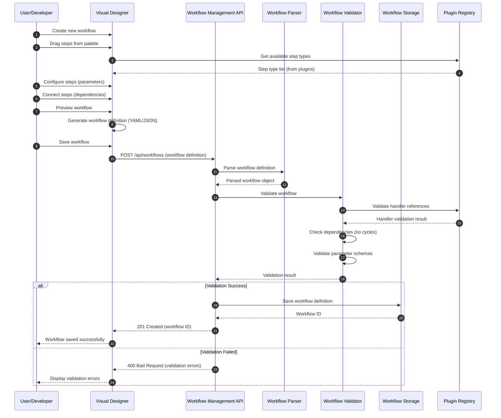
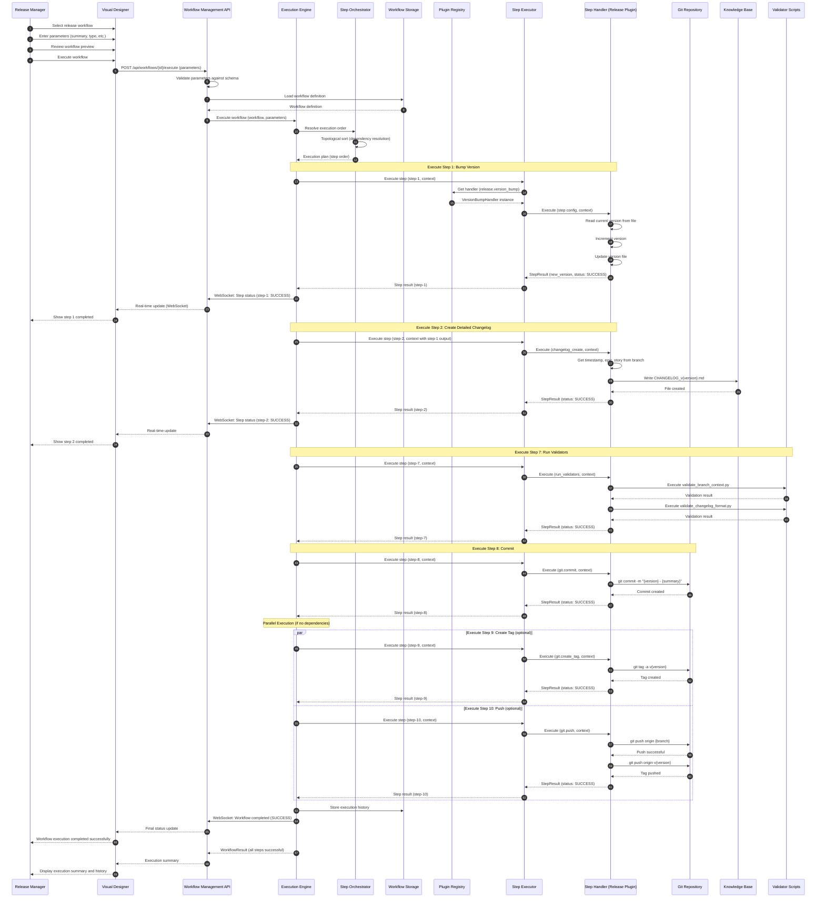
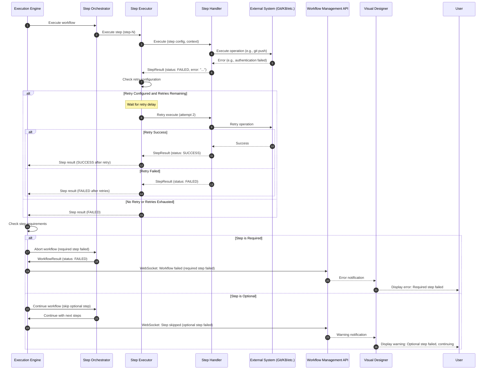
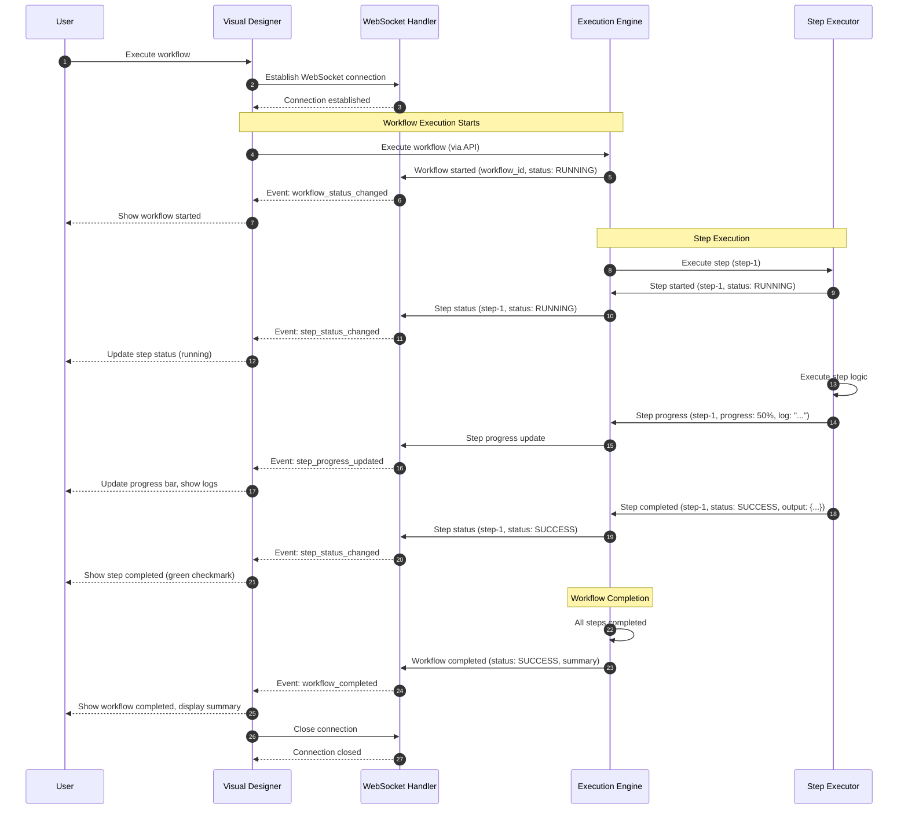
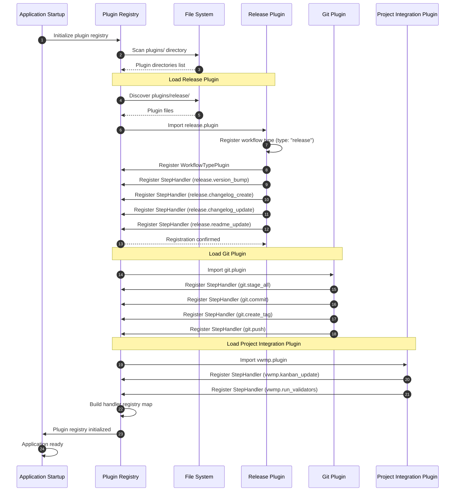
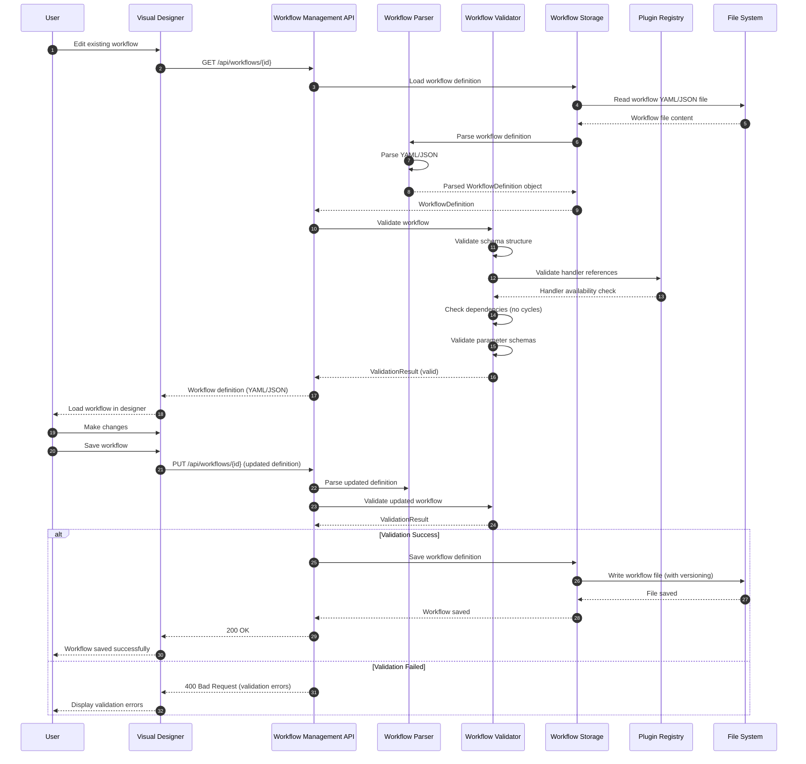

# Epic 01 – VWMP Runtime Sequence Diagrams

**Status:** Draft
**Epic:** Epic 01 - Visual Workflow Management Platform (VWMP)
**Last Updated:** 2025-11-20
**Related Artifacts:**
- `KB/Architecture/component/overview/epic01-vwmp-components.md`
- `KB/Architecture/Standards_and_ADRs/E01-vwmp-platform-architecture.md`
- `KB/Architecture/Diagrams/Runtime/epic01-vwmp-sequences.md`

---

## 1. Workflow Creation Sequence

### Creating a New Workflow

---

## 2. Workflow Execution Sequence (Release Workflow)

### Executing a Release Workflow

---

## 3. Error Handling Sequence

### Handling Step Failure with Retry

---

## 4. Real-Time Monitoring Sequence

### WebSocket Real-Time Updates

---

## 5. Plugin Discovery and Registration Sequence

### Plugin Loading at Startup

---

## 6. Workflow Definition Storage Sequence

### Loading and Validating Workflow

---

## 7. Related Documents

- **Component View:** `KB/Architecture/component/overview/epic01-vwmp-components.md`
- **Container View:** `KB/Architecture/container/overview/epic01-vwmp-container.md`
- **Integration Architecture:** `KB/Architecture/Integration_Architecture/vwmp/vwmp-integration-architecture.md`
- **Main Architecture:** `KB/Architecture/Standards_and_ADRs/E01-vwmp-platform-architecture.md`

---

_Next steps_: Create PlantUML versions of these diagrams for KB Diagrams directory
